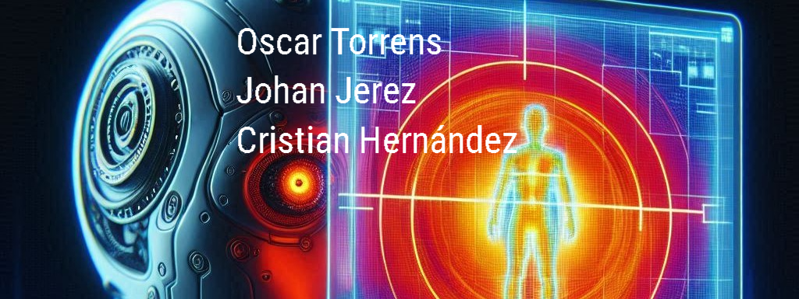

<h1>CLASIFICACIÓN DE AUTOS Y PERSONAS CON IMÁGENES TÉRMICAS</h1>

Autores: Oscar Torrens, Johan Jerez, Cristian Hernandez

Objetivo: Desarrollar un modelo de IA capaz de clasificar personas y carros en imagenes termicas

Dataset: El dataset utilizado contiene 26,442 imágenes térmicas capturadas desde un vehículo. Cada imagen incluye anotaciones con las coordenadas de 15 categorías de objetos que pueden aparecer en ellas. Todos los detalles y descarga en: https://www.flir.com/oem/adas/adas-dataset-form/

Metodos: Decision Tree, Random Forest, SVM, Deep learning

## Enlaces:

Codigo: https://colab.research.google.com/drive/1G0uA_iSGe-nGSy7zWt6H5DzcFS2qSKyQ?usp=sharing

Video: https://drive.google.com/file/d/1DuJ9sw-26uC-j4FWOnNg3DdRD0-2bRNc/view?usp=sharing
